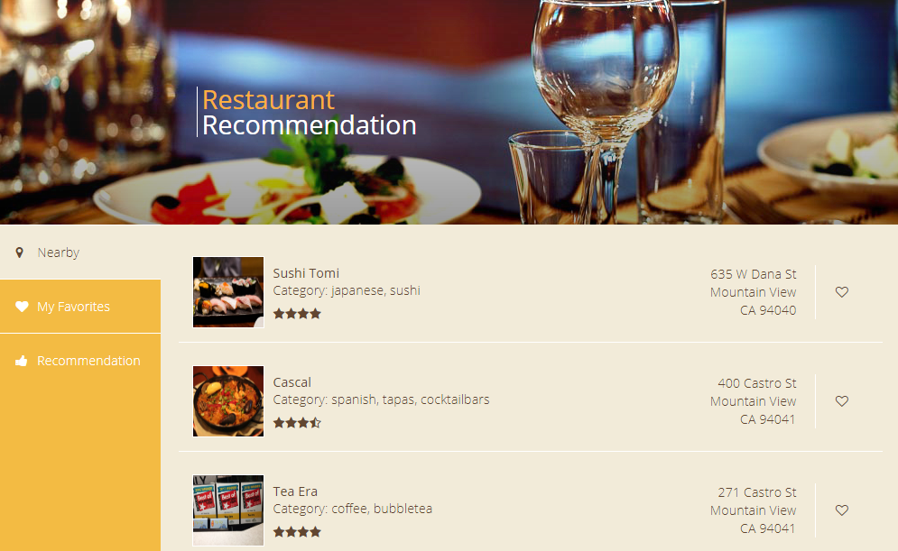

# Local Restaurant Recommendation Web App

[Link to web app](http://18.218.232.99:8080/Titan/#) (deployed on AWS EC2)

**Front End**

**Back End**

- runs a web service (Java servlet, REST API) to fetch local restaurant data from Yelp API based on users' geolocations; 
- utilizes a MySQL server to store real restaurants data, along with users' favorites and search history for future recommendation
- uses a content-based recommendation algorithm based on users’
  favorites and search history

